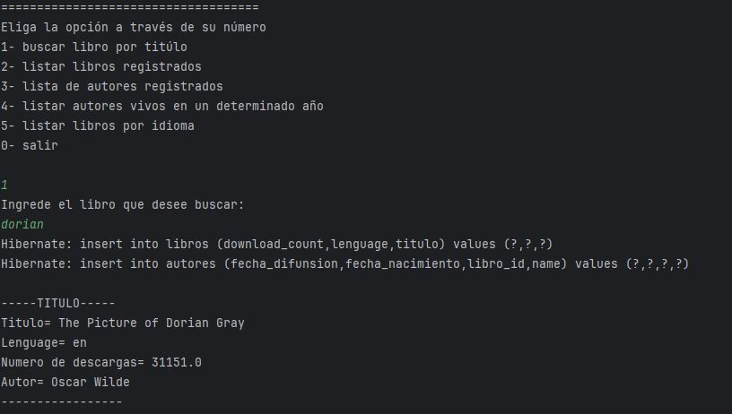
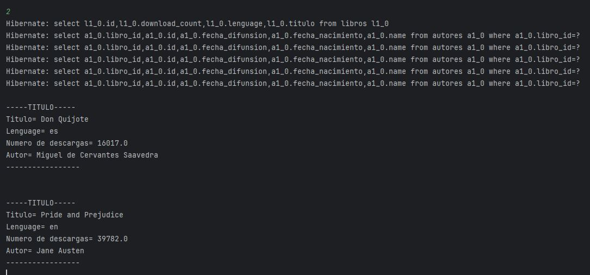
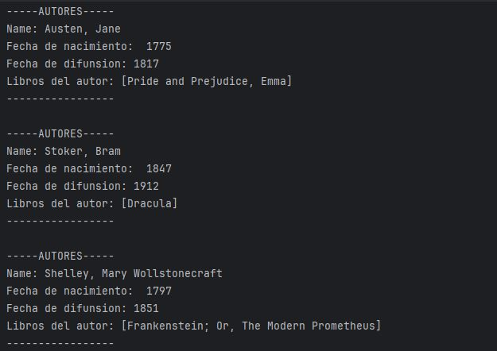
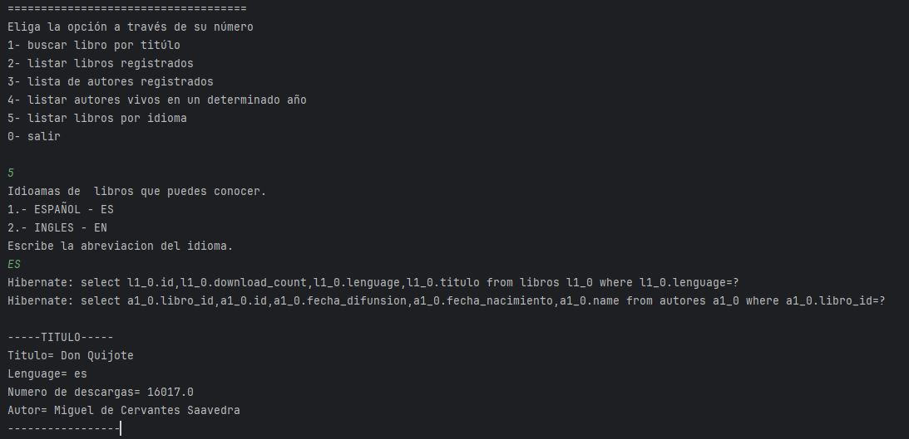

<h1 align="center"> Challenge Literatura, practicando Spring Boot. </h1>

## Índice

-[Índice](#índice)

-[Descripción del proyecto](#descripción-del-proyecto)

-[Estado del proyecto](#Estado-del-proyecto)

-[Características de la aplicación y demostración](#Características-de-la-aplicación-y-demostración)

-[Tecnologías utilizadas](#tecnologías-utilizadas)

-[Personas-Desarrolladores del Proyecto](#personas-desarrolladores)

-[Conclusión](#conclusión)

##  Descripción del proyecto.
Este proyecto se realizó con la finalidad de aplicar los conocimientos adquiridos durante los cursos de Spring y Java. 
Teniendo como resultado la creación de un proyecto dinámico que nos brinda y nos permite consultar la información necesaria 
sobre ciertos libros y sus respectivos autores. Para ello, fue necesario consumir una API gratuita como "https://gutendex.com/books".

##  Estado del Proyecto
El proyecto se encuntra finalizado.

##  Características de la aplicación y demostración 

-  La aplicación dispone de una interfaz de texto a través de la consola, lo que nos permite interactuar con el usuario.
  

    
  
 
  -  La aplicación dispone de una interfaz de texto a través de la consola, lo que nos permite interactuar con el usuario.
  

    
  
 
  -  La aplicación dispone de una interfaz de texto a través de la consola, lo que nos permite interactuar con el usuario.
  

    
  
 
  -  La aplicación dispone de una interfaz de texto a través de la consola, lo que nos permite interactuar con el usuario.
  

    
  
 
  -  La aplicación dispone de una interfaz de texto a través de la consola, lo que nos permite interactuar con el usuario.
  

    
  
 

##  Tecnologías utilizadas
|Herramientas|Lenguaje|IDE|
|:----------:|:--------:|:---:|
|JPA, SpringBoot|Java|IntelliJ 2024|

##  Conclusión
Aplicar los conocimientos de los cursos de Spring Boot y Java nos dio como resultado la capacidad de crear y desarrollar un desafío que nos retó a demostrar nuestro análisis,
el conocimiento de Java, utilizar herramientas como JPA y JPQL, así como probar nuestro propio código y lograr realizar ciertas consultas desde la base de datos de PostgreSQL.

##  Personas-Desarrolladores del Proyecto
-  Desarrollado por Alejandra López
