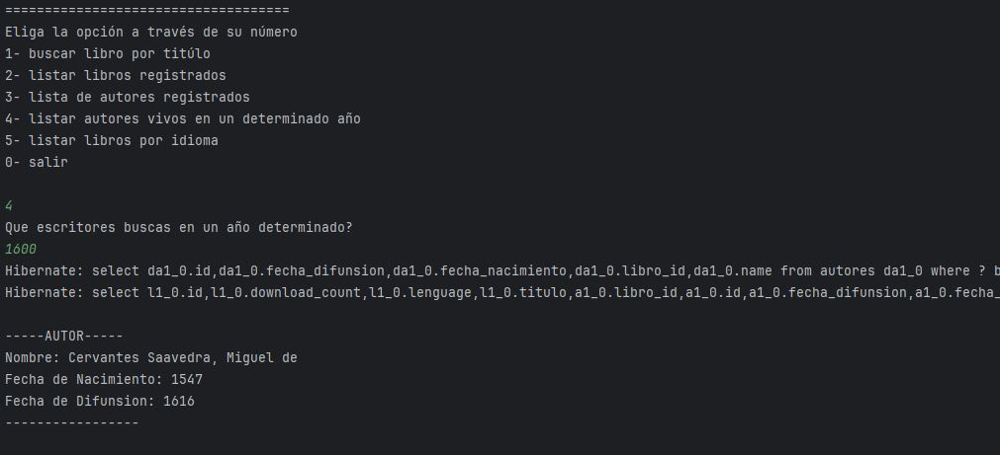

<h1 align="center"> Challenge Literatura, practicando Spring Boot. </h1>

## Índice

-[Índice](#índice)

-[Descripción del proyecto](#descripción-del-proyecto)

-[Estado del proyecto](#Estado-del-proyecto)

-[Características de la aplicación y demostración](#Características-de-la-aplicación-y-demostración)

-[Tecnologías utilizadas](#tecnologías-utilizadas)

-[Personas-Desarrolladores del Proyecto](#personas-desarrolladores)

-[Conclusión](#conclusión)

##  Descripción del proyecto.
Este proyecto se realizó con la finalidad de aplicar los conocimientos adquiridos durante los cursos de Spring y Java. 
Teniendo como resultado la creación de un proyecto dinámico que nos brinda y nos permite consultar la información necesaria 
sobre ciertos libros y sus respectivos autores. Para ello, fue necesario consumir una API gratuita como "https://gutendex.com/books".

##  Estado del Proyecto
El proyecto se encuntra finalizado.

##  Características de la aplicación y demostración 

- La aplicación cuenta con una interfaz de texto a través de la consola, lo que permite la interacción con el usuario. Este puede elegir entre un conjunto de opciones para buscar información sobre un libro simplemente escribiendo su nombre. Si el libro existe, la consulta a la API proporcionará los datos más relevantes sobre esta búsqueda, los cuales se almacenarán en nuestra base de datos PostgreSQL utilizando la tecnología JDBC. En caso contrario, se mostrará un mensaje indicando que el libro no está disponible..
  

    
  
 
  - Una vez almacenados los datos en la base de datos, fue necesario aprender a realizar consultas desde su entorno. Para ello, fue indispensable revisar la documentación y conocer las posibles opciones disponibles para las consultas realizadas durante el Challenge. Un ejemplo de ello es la consulta que permite obtener todos los libros existentes junto con los nombres de sus respectivos autores
  

    
  
 
  - La siguiente opción permite que el usuario conozca una lista de los autores registrados junto con sus respectivos libros. Para ello, creé una nueva clase que contiene los campos correspondientes a cada autor con sus libros, utilizando JPA de Spring Framework.
  

    
  
 
  - "Leer la documentación es indispensable para realizar las consultas de forma adecuada. Esta opción permite visualizar la lista de autores que se encuentran activos en una fecha que el usuario puede ingresar. En caso de que no se obtenga ningún autor, la lista regresará vacía y se mostrará un mensaje.
  

    
  
 
  -  Por último, es posible consultar los libros disponibles en un idioma específico. La interfaz de la consola ofrece dos opciones de idioma que se pueden ingresar: Español o Inglés.
  

    
  
 

##  Tecnologías utilizadas
|Herramientas|Lenguaje|IDE|
|:----------:|:--------:|:---:|
|JPA, SpringBoot|Java|IntelliJ 2024|

##  Conclusión
Aplicar los conocimientos de los cursos de Spring Boot y Java nos dio como resultado la capacidad de crear y desarrollar un desafío que nos retó a demostrar nuestro análisis,
el conocimiento de Java, utilizar herramientas como JPA y JPQL, así como probar nuestro propio código y lograr realizar ciertas consultas desde la base de datos de PostgreSQL.

##  Personas-Desarrolladores del Proyecto
-  Desarrollado por Alejandra López
